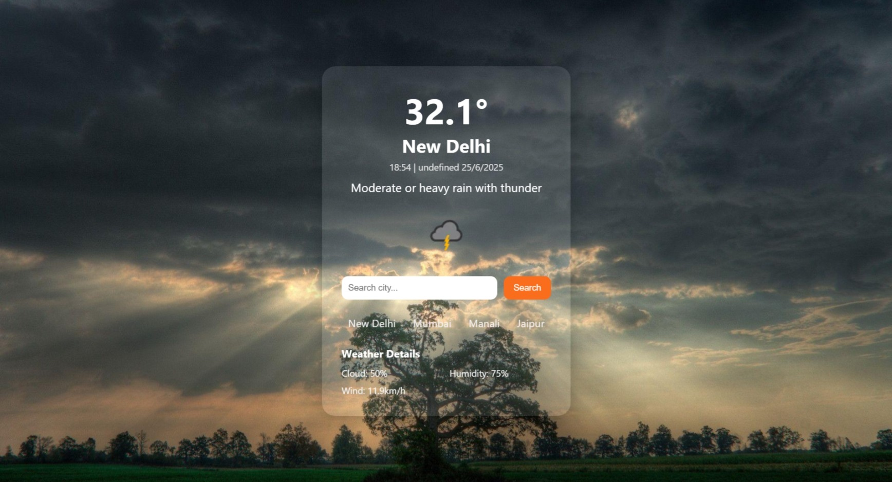

# MyWeatherNow
A responsive weather forecast web app built with HTML, CSS, and JavaScript that fetches real-time weather data using the Weather API.
## 📌 Features
- Get current temperature, weather condition, and wind/humidity details
- Shows local time and date of the searched city
- Predefined popular city shortcuts
- Clean and simple layout
## 🛠 Tech Stack
- HTML  
- CSS  
- JavaScript  
- WeatherAPI (for real-time data)
## 🚀 How to Use
1. Clone or download this repository.
2. Open the project in your code editor.
3. Go to `script.js` and **replace the sample API key** with your own from [WeatherAPI](https://www.weatherapi.com).
4. Open `index.html` in your browser.
## 🖼️ Preview

🔑 *Note:* API key has been removed for security. Please use your own key in the JS file.

